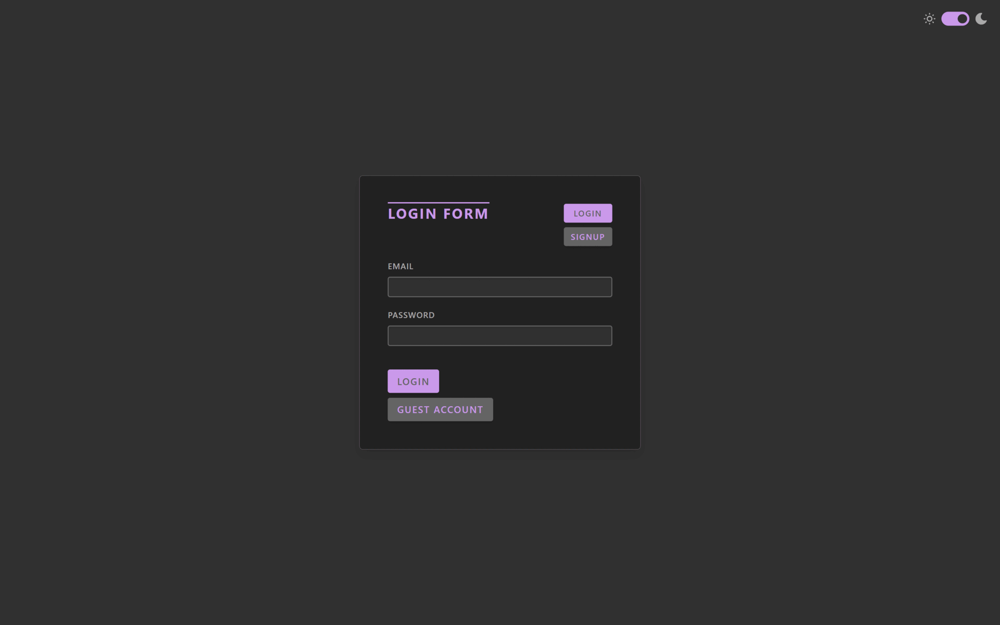

# Workout Tracker

See the live version of [Workout Tracker](https://workout-tracker-dudziak.netlify.app/).

My first FullStack project created for tracking your gym progress as a summary of the completed React course.

**Main features**:

- 📋 Workout & Training Plan Management
- 📈 Track Your Progress
- 🔒 User Authentication
- 🌗 Dark & Light Theme
- 📱 Responsive Design

&nbsp;

## 💡 Technologies

&nbsp;

## 💭 Conclusions for future projects

I would like to:

- add TypeScript
- create more reusable components
- make forms more user friendly
- add more details on the dashboard

&nbsp;

## 👏 Thanks

Thanks to [Jonas Schmedtmann](https://www.udemy.com/user/jonasschmedtmann/) – for providing me knowladge in his [Ultimate React Course](https://www.udemy.com/course/the-ultimate-react-course/).
